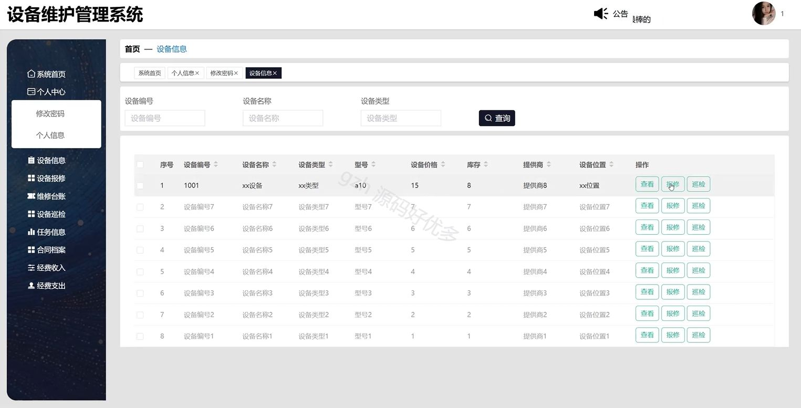
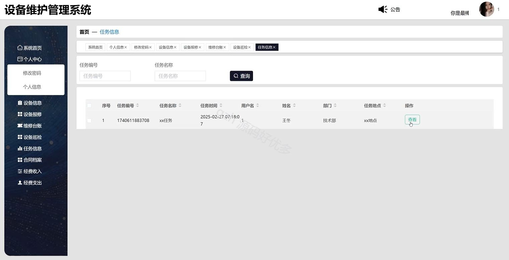
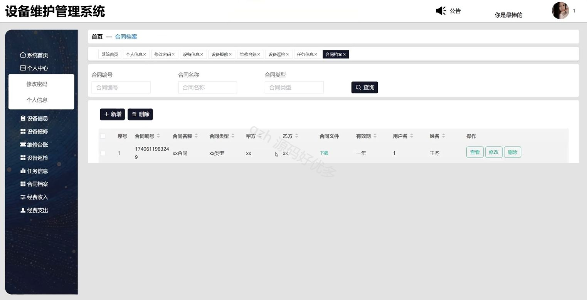
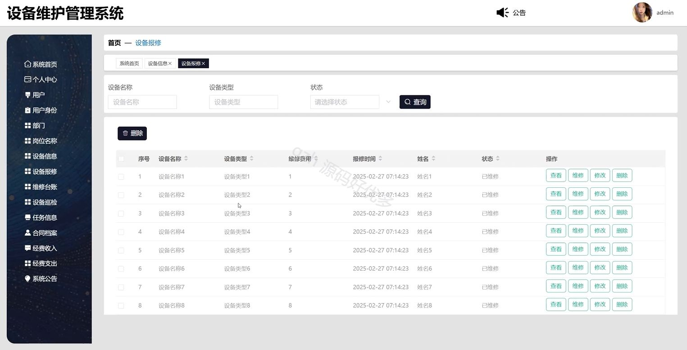
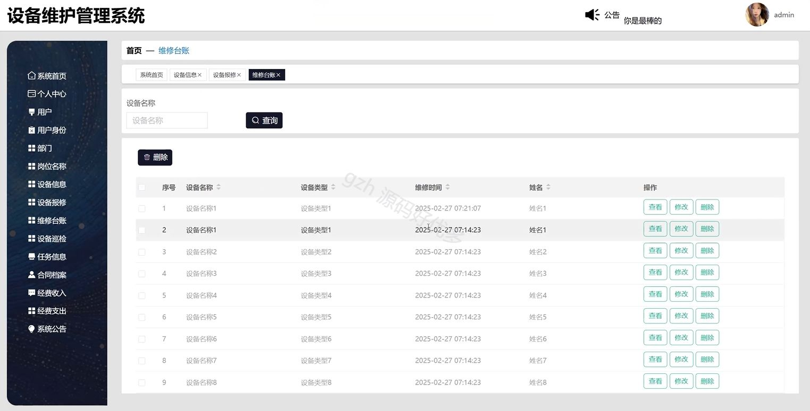
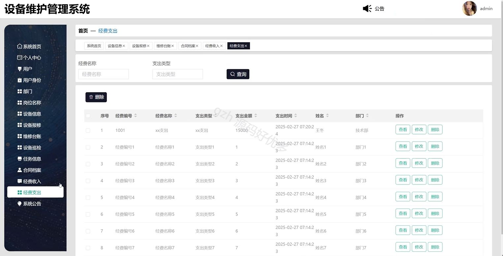
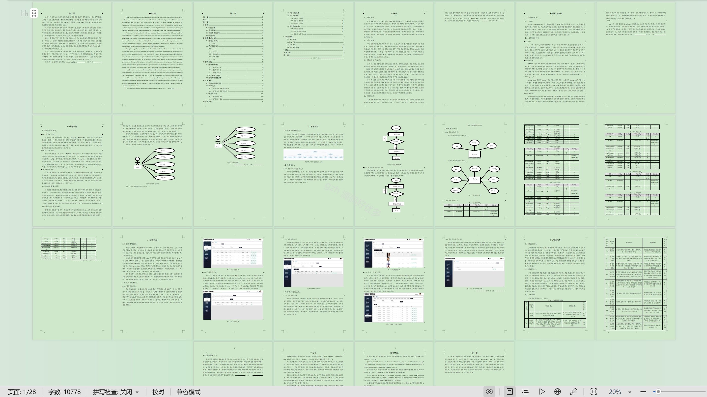

# springbootA043D
springbootA043D设备维护管理系统
## 查看主页获取源码

### 一、关键词

设备信息、设备报修、维修台账

 

### 二、作品包含

源码+数据库+设计文档万字+全套环境和工具资源+部署教程

 

### 三、项目技术

前端技术：Html、Css、Js、Vue2.0、Element-ui 
后端技术：Java、SpringBoot2.0、MyBatis

  

 

### 四、运行环境（以下版本亲测，其他版本未知，请自测）

开发工具：IDEA/eclipse  + VSCODE

数据库：MySQL5.7（最低要5.7版本）

数据库管理工具：Navicat10以上版本

环境配置软件： JDK1.8 + Maven3.6.3

前端Nodejs：14

浏览器：谷歌浏览器

 

### 五、项目介绍

项目编号：springbootA043D

设备维护管理系统是用来高效管理和优化设备维护工作，以减少故障、延长设备寿命并降低运营成本。

角色：管理员、用户

管理员：登录、系统首页、个人中心、用户、用户身份、部门、岗位名称、设备信息、设备报修、维修台账、设备巡检、任务信息、合同档案、经营收入、经营支出、系统公告。

用户：注册、登录、系统首页、个人中心、设备信息、设备报修、维修台账、设备巡检、任务信息、合同档案、经营收入、经营支出。

 

### 六、运行截图

